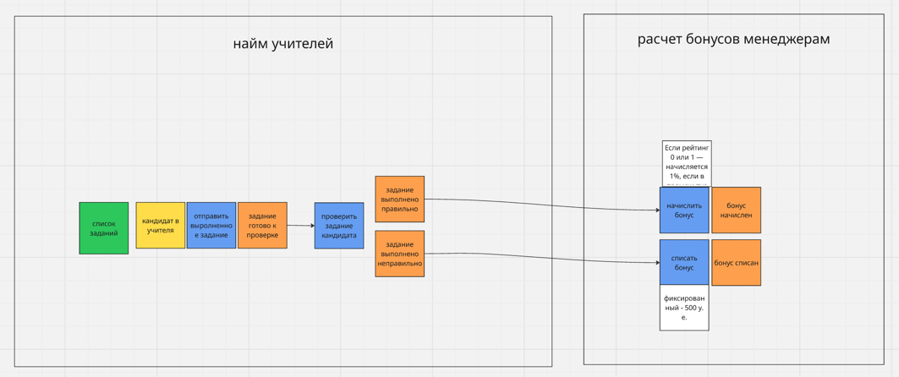

# ADR 1: Исправление eventual consistency для рейтинга заданий между наймом учителей и расчетом бонусов менеджерам

### Status: Accepted

### Context

На момент принятия решения рейтинг был непосредственно связан с событиями о проверке задания (правильно/неправильно) и соответсвтенно передавался внутри этих событий

После автоматической проверки задания, сервис найма учителей отправлял асинхронное событие TaskRating. События правильности/неправильности выполненного задания асинхронные. 

К сожалению, у бизнеса возникли проблемы с такой реализацией коммуникации, которые выглядели так:
- Логика начисления бонусов некорректна из-за ошибки с рейтингом задания. Во время начисления бонусов во время изменения рейтинга, происходит задержка, которая не удовлетворяет бизнес (нужно моментально).

Данная проблема возникала из-за eventual consistency, который возник из-за использования асинхронной коммуникации. Чтобы решить проблему, нужно добиться strong consistency в этом месте.

### Decision

Единственный способ решить проблему перехода с eventual consistency на strong consistency — перевести связь с асинхронной на синхронную. Так как синхронная связь может быть только request-response, то остаётся выбрать способ имплементации в коде.
В нашем проекте для коммуникации между сервисами используются http-вызовы. Следовательно, асинхронное событие TaskRating будет заменено на синхронный http-вызов для формальной связи.

### Consequences
В результате решения проблемы мы перестали терять деньги и некорректно выплачивать менеджерам бонусы, так как эти операции напрямую зависели от рейтинга. При этом события с выполнением задания остались асинхронными, что позволило не блокировать сервисы и сохранить performance